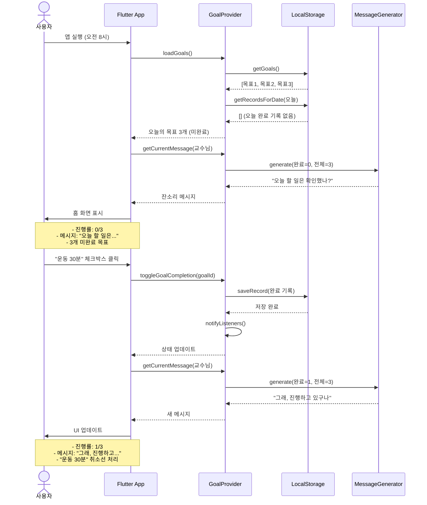

# 2. 목표 완료 체크 (일반 목표)

```mermaid
sequenceDiagram
    actor User as 사용자
    participant App as Flutter App
    participant Provider as GoalProvider
    participant Storage as LocalStorage
    participant MessageGen as MessageGenerator

    User->>App: 앱 실행 (오전 8시)
    App->>Provider: loadGoals()
    Provider->>Storage: getGoals()
    Storage-->>Provider: [목표1, 목표2, 목표3]
    Provider->>Storage: getRecordsForDate(오늘)
    Storage-->>Provider: [] (오늘 완료 기록 없음)
    Provider-->>App: 오늘의 목표 3개 (미완료)
    
    App->>Provider: getCurrentMessage(교수님)
    Provider->>MessageGen: generate(완료=0, 전체=3)
    MessageGen-->>Provider: "오늘 할 일은 확인했나?"
    Provider-->>App: 잔소리 메시지
    App->>User: 홈 화면 표시
    Note over App,User: - 진행률: 0/3<br/>- 메시지: "오늘 할 일은..."<br/>- 3개 미완료 목표
    
    User->>App: "운동 30분" 체크박스 클릭
    App->>Provider: toggleGoalCompletion(goalId)
    Provider->>Storage: saveRecord(완료 기록)
    Storage-->>Provider: 저장 완료
    Provider->>Provider: notifyListeners()
    Provider-->>App: 상태 업데이트
    
    App->>Provider: getCurrentMessage(교수님)
    Provider->>MessageGen: generate(완료=1, 전체=3)
    MessageGen-->>Provider: "그래, 진행하고 있구나"
    Provider-->>App: 새 메시지
    
    App->>User: UI 업데이트
    Note over App,User: - 진행률: 1/3<br/>- 메시지: "그래, 진행하고..."<br/>- "운동 30분" 취소선 처리
```