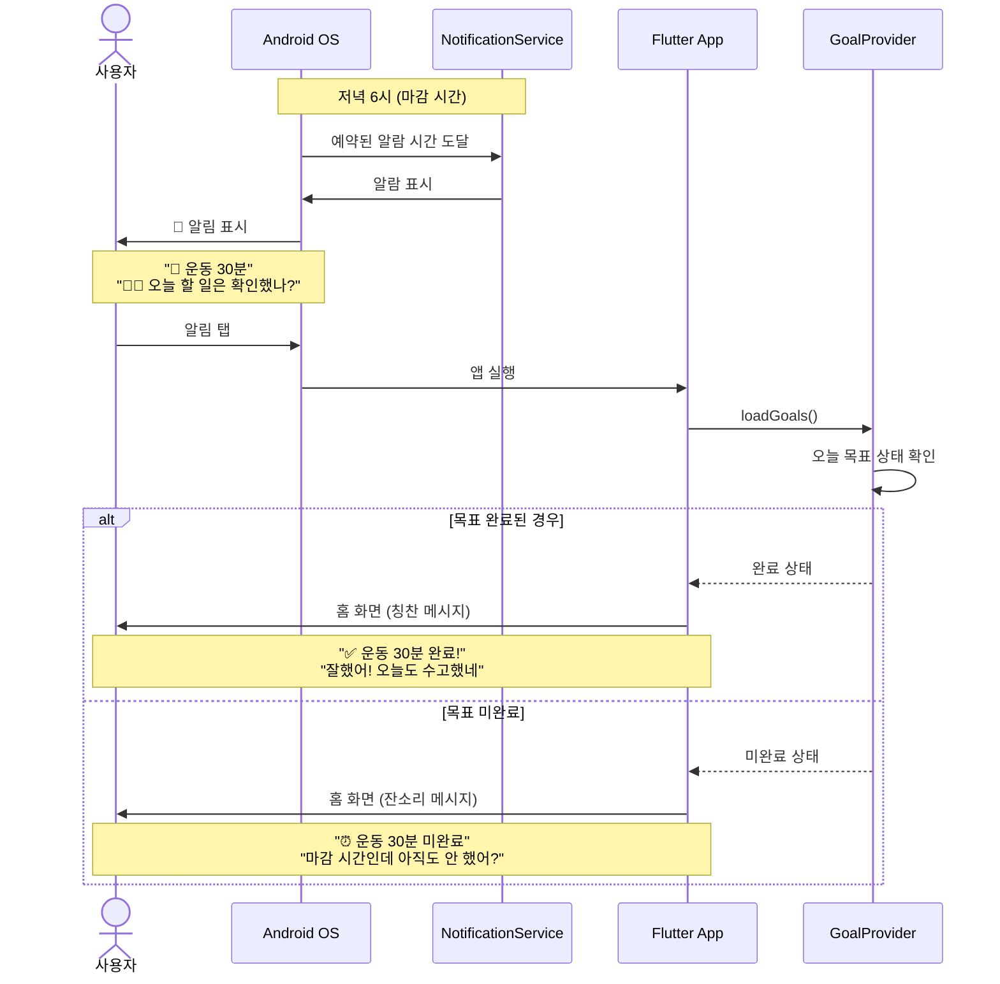

# 4. 알람 수신 및 앱 확인

```mermaid
sequenceDiagram
    actor User as 사용자
    participant OS as Android OS
    participant Notification as NotificationService
    participant App as Flutter App
    participant Provider as GoalProvider

    Note over OS,Notification: 저녁 6시 (마감 시간)
    
    OS->>Notification: 예약된 알람 시간 도달
    Notification->>OS: 알람 표시
    OS->>User: 🔔 알림 표시
    Note over OS,User: "🎯 운동 30분"<br/>"👨‍🏫 오늘 할 일은 확인했나?"
    
    User->>OS: 알림 탭
    OS->>App: 앱 실행
    App->>Provider: loadGoals()
    Provider->>Provider: 오늘 목표 상태 확인
    
    alt 목표 완료된 경우
        Provider-->>App: 완료 상태
        App->>User: 홈 화면 (칭찬 메시지)
        Note over App,User: "✅ 운동 30분 완료!"<br/>"잘했어! 오늘도 수고했네"
    else 목표 미완료
        Provider-->>App: 미완료 상태
        App->>User: 홈 화면 (잔소리 메시지)
        Note over App,User: "⏰ 운동 30분 미완료"<br/>"마감 시간인데 아직도 안 했어?"
    end
```